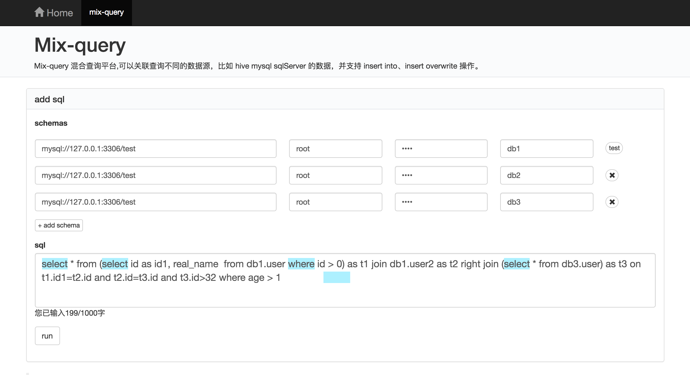

# mix-query
```
jdbc:mysql://192.168.1.101:3306/test
jdbc:mysql://192.168.1.101:3306/finebi

//this.sql = "insert overwrite db1.user select id, real_name from (select id as id1  from db1.user2) as t1 left join db3.user as t2 on t1.id1=t2.id where id1 >= 2";
//this.sql = "insert into db1.user select age, real_name from (select * from db1.user2) as t1 left join (select * from db3.user) as t2 on t1.id=t2.id where age >= 2";
this.sql = "select * from (select id as id1, real_name  from db1.user where id > 0) as t1 join db1.user2 as t2 right join (select * from db3.user) as t3 on t1.id1=t2.id and t2.id=t3.id and t3.id>32 where age > 1";
// 子查询里面不能有链接，因为我们建立 rdd 是根据表的，所以没法搞，如果要链接可以改成写在外链接
//this.sql = "select * from (select * from db1.user left join db1.user2 on user.id=user2.id) as t1 join db1.user2 as t2 on t1.id=t2.id";
//this.sql = "select * from (select * from db1.user) as t1 left join db2.user as t3 join db1.user2 as t2 on t1.id=t3.id and t3.id=t2.id";
// 目前不支持但表的 insert 操作 this.sql = "insert into db1.user select * from db1.user";
//this.sql = "select * from db1.user as t1 left join db1.user as t2 on t1.id=t2.id";
// 参数格式转化
```



